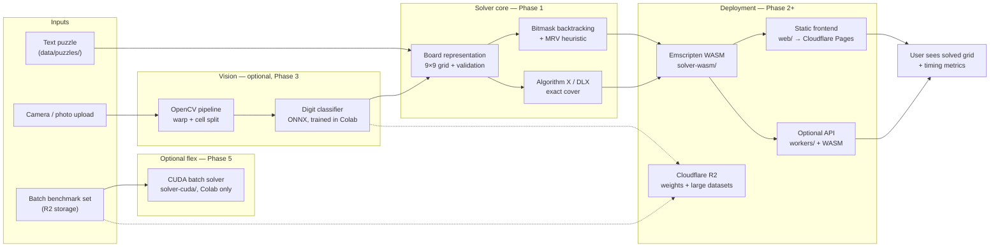

# Architecture

High-level vision for **sudoku-edge-pipeline**: an end-to-end system that can ingest a Sudoku puzzle (text, photo, or batch file), solve it with multiple optimized engines, and expose results through a browser demo deployed on Cloudflare.

This document describes the **target** architecture. Components are built incrementally; not everything exists yet.

## System diagram

## Data flow (happy path)

1. **Text path (simplest):** A 9×9 puzzle string (`.` = empty) is loaded into `Board`, passed to a `Solver` implementation, and the solved grid is returned.
2. **Photo path (later):** OpenCV finds and warps the grid; a CNN classifies each cell; the resulting 81-character string enters the same `Board` → `Solver` path.
3. **Web path:** The bitmask solver is compiled to WASM and runs in the browser (or behind a Cloudflare Worker). No GPU server required for 9×9 solves.
4. **Batch path (optional):** Thousands of puzzles are solved in parallel on a Colab GPU for benchmark numbers only — not deployed to edge.

## Module map

| Directory      | Role                                      | Phase |
|----------------|-------------------------------------------|-------|
| `solver-cpp/`  | Board, solvers, tests, benchmarks         | 1     |
| `solver-wasm/` | C++ → WASM bindings for the web           | 2     |
| `web/`         | Frontend UI, loads WASM                   | 2     |
| `vision/`      | OpenCV + CNN training/inference           | 3     |
| `workers/`     | Optional Cloudflare Worker API            | 4     |
| `solver-cuda/` | GPU batch benchmarks (Colab)              | 5     |
| `data/puzzles/`| Small in-repo puzzle fixtures for tests   | 0     |

## Design constraints

- **One solver interface, many implementations** — all solvers implement the same API so benchmarks are apples-to-apples.
- **Keep heavy assets out of git** — model weights and large datasets live in R2; see `.gitignore`.
- **Client-side first for vision** — real-time webcam demos run in the browser; edge workers handle static hosting and optional API, not custom TensorRT/CUDA.
